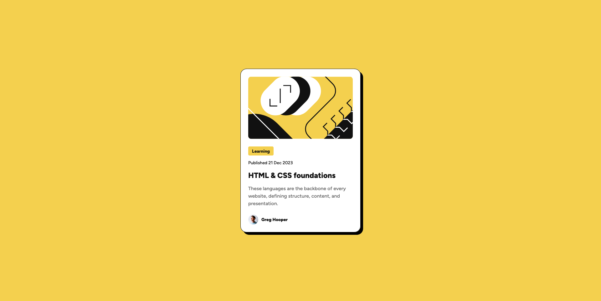

# Frontend Mentor - Blog preview card solution

This is a solution to the [Blog preview card challenge on Frontend Mentor](https://www.frontendmentor.io/challenges/blog-preview-card-ckPaj01IcS). Frontend Mentor challenges help you improve your coding skills by building realistic projects. 

## Table of contents

- [[#Overview]]
  - [[#The challenge]]
  - [[#Screenshot]]
  - [[#Links]]
- [[#My process]]
  - [[#Built with]]
  - [[#Built with]]
  - [[#Continued development]]
  - [[#AI Collaboration]]
- [[#Author]]

## Overview
This project serves as a solution to the Blog Preview challenge from Frontend Mentor. The objective is to refine the ability to build responsive components, with a focus on achieving high-fidelity design precision.

### The challenge
- **Responsiveness:** Implement layout designs tailored for 1440px and 375px screen resolutions.
- **Hover Animations:** Integrate transition effects for interactive elements to enhance user engagement.

### Screenshot



### Links

- [Solution URL](https://your-solution-url.com)
- [Live Site URL](https://your-live-site-url.com)

## My process

### Built with

- Semantic HTML5
- CSS
- Flexbox

### What I learned

The primary challenge I encountered during this project was achieving responsiveness, as it requires distinct layouts for 1440px and 375px viewports, particularly regarding text and image scaling. To address this, I utilized media queries. Following industry best practices, I adopted a 'mobile-first' design approach, which has provided valuable insights into building modern, responsive interfaces. Below is an example of the code implemented for the desktop layout using media queries:

```css
@media (width > 375px) {
  .card-container {
   ...
  }
  ...
}
```

### Continued development

I am gaining a solid understanding of the frontend development lifecycle, encompassing responsive design, clean coding practices, and refined interactive transitions. Moving forward, I intend to seek out new challenges to further develop my skills and apply the lessons learned from this project.
### AI Collaboration

Tools AI : Gemini 3.1 Flash-Lite

For this project, I leveraged AI as a collaborative tool to resolve coding challenges through conceptual analogies. Specifically, I utilized it for:

1. Defining the initial development workflow and priorities.
2. Brainstorming architectural and logic-based solutions.
3. Identifying tools to ensure design fidelity and alignment with project specifications."
4. 
## Author

- GitHub - [haidan-0e](https://github.com/haidan-0e)
- Frontend Mentor - [@haidan-0e](https://www.frontendmentor.io/profile/haidan-0e)


